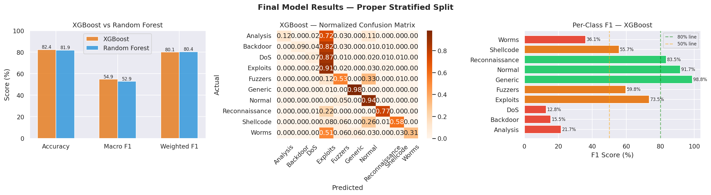
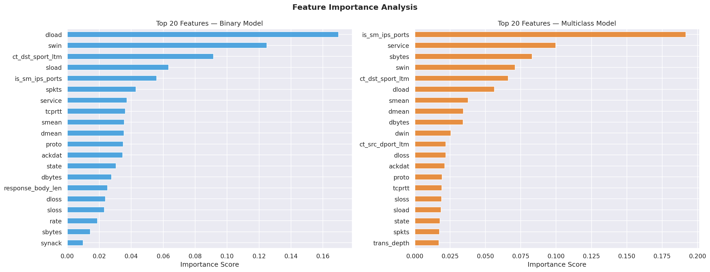

# 🔐 AI Intrusion Detection System

## 🚀 Overview
This project is a real-time Network Intrusion Detection System (NIDS) built using Machine Learning. It analyzes network traffic patterns to identify potential security threats such as DoS attacks, Exploits, and Fuzzers using the **UNSW-NB15** dataset.

## 📊 Project Visualizations
### Model Performance Comparison

### Feature Importance (What the AI looks for)

## 🛠️ Tech Stack
* **Language:** Python 3.11
* **ML Framework:** XGBoost, Scikit-Learn
* **Dashboard:** Streamlit, Plotly
* **Dataset:** UNSW-NB15 (175K+ records)

## 📈 Performance Summary
| Model Type | Accuracy | F1-Score | ROC-AUC |
| :--- | :--- | :--- | :--- |
| **Binary (Normal vs Attack)** | 94.17% | 95.43% | 98.99% |
| **Multiclass (Categorization)** | 82.41% | 54.91% (Macro) | - |

> **Note:** The Macro F1 score reflects the extreme class imbalance in real-world network data (e.g., very few "Worms" samples compared to "Normal" traffic), which is a common challenge in cybersecurity AI.

## 📁 Project Structure
* `streamlit/app.py`: The live dashboard code.
* `streamlit/models/`: Trained XGBoost model files and scalers.
* `outputs/`: Performance charts and evaluation plots.
* `requirements.txt`: Python dependency list for deployment.

## 📖 How to Test the AI
1. Visit the [Live Demo](https://intrusion-detection-ai-hzv5kw8ggacqgaeqjf7h9u.streamlit.app/).
2. Click **"🚨 Load Attack Sample"** to auto-fill the form with malicious parameters (high source bytes, specific protocol states).
3. Click **"Analyze Traffic"** to see the AI identify the threat and calculate confidence levels for different attack types.

---
Created by [ArpanSandhu-s](https://github.com/ArpanSandhu-s)
